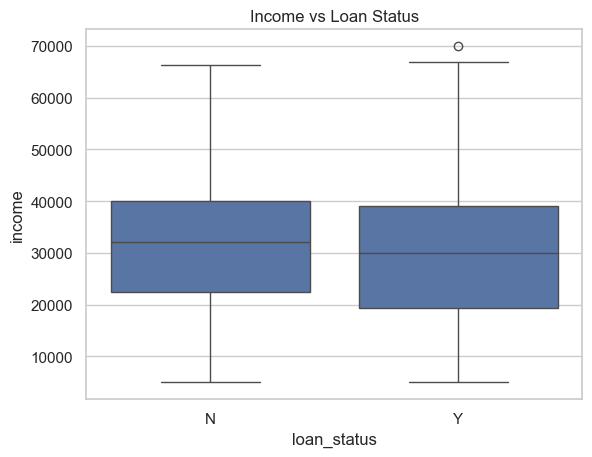

# 📊 Loan Default Analysis Project

This project analyzes loan application data to identify factors that contribute to loan default. It uses real-world datasets to perform data cleaning, EDA, statistical testing, and derive actionable insights.  

---

## 📁 Folder Structure

Loan-default-analysis/
│
├── data/ # Raw CSV files
├── notebooks/ # Jupyter Notebook for EDA & testing
├── output/ # Saved charts/plots
├── docs/ # Summary and documentation
├── requirements.txt # Required libraries
└── README.md # Project overview

---

## 📌 Objective

To uncover insights from demographic and financial data that influence whether a loan gets approved or not — and support risk assessment in loan applications.

---

## 🔍 Key Steps Performed

| Step              | Description                                            |
|-------------------|--------------------------------------------------------|
| ✅ Data Cleaning   | Handled missing values, verified types                |
| ✅ EDA             | Univariate & Bivariate analysis (age, income, etc.)  |
| ✅ Visualization   | Countplot, histogram, boxplot, heatmap               |
| ✅ Statistical Testing | Chi-square, T-test, ANOVA (Scipy)             |
| ✅ Documentation   | Summary reports in Markdown files                    |
| ✅ Organized Code  | Jupyter Notebook, structured folders                 |

---

## 🧪 Tools & Technologies Used

- **Python:** pandas, numpy, seaborn, matplotlib, scipy
- **Jupyter Notebook**
- **Markdown**
- **VS Code / GitHub**

---

## 📊 Sample Visuals

  
*Other visuals include gender distribution, credit heatmap, education-based approval, etc.*

---

## 📄 Summary Report

See [`docs/summary.md`](docs/summary.md) for final summary  
See [`docs/eda_summary.md`](docs/eda_summary.md) for EDA explanation

---

## 🙋‍♂️ Author

**Tarun Kumar Malviya**  
_Data Analyst | Python | SQL | Tableau | EDA | Hypothesis Testing_

---

## 📬 Contact

For collaboration or queries:  
📧 tarunmalviya804@gmail.com

---

## ✅ Status

✅ Completed: EDA + Hypothesis Testing  
🟡 Optional Next Phase: ML Modeling (Logistic Regression)
